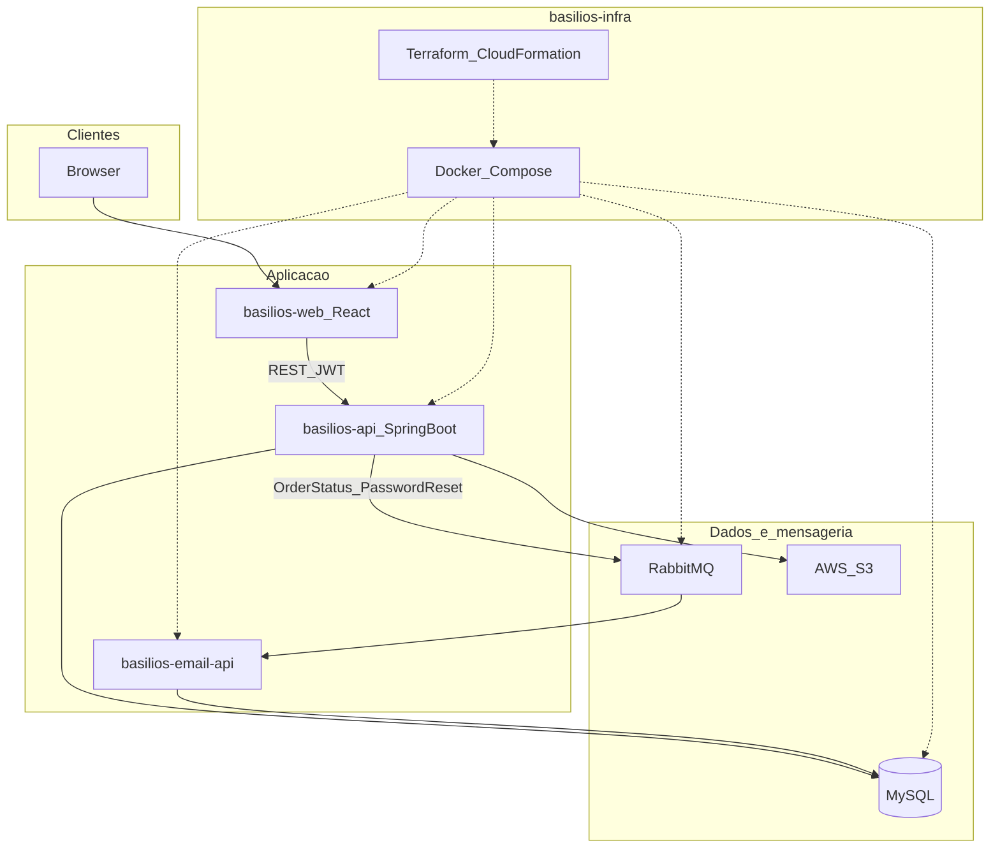

# Basilios Docs

Documentação e artefatos de arquitetura do projeto **Basilios** (plataforma de delivery — SPTech).

## Arquitetura (visão do ecossistema)

Fluxo principal: o cliente usa o **web**; a **api** autentica (JWT), persiste pedidos/produtos no **MySQL** e envia imagens ao **S3**; mudanças de status e reset de senha vão para o **RabbitMQ** e são consumidas pelo **email-api**.

## Diagramas e artefatos no repositório

- `arquitetura_aws.png` / `arquitetura_v2.png` / `diagram_v1.png`
- `diagrama de classes.png`
- Planilha de arquitetura do grupo
- `code-snippets/`, `Docs-JUnit/`, `sql/`

## Repositórios de código

| Repositório | Papel |
|-------------|--------|
| [basilios-web](https://github.com/Basilios-SPTech/basilios-web) | Frontend React |
| [basilios-api](https://github.com/Basilios-SPTech/basilios-api) | API Spring Boot |
| [basilios-email-api](https://github.com/Basilios-SPTech/basilios-email-api) | Microsserviço de e-mail |
| [basilios-infra](https://github.com/Basilios-SPTech/basilios-infra) | Docker + IaC AWS |

## Licença

MIT — veja [LICENSE](LICENSE).
